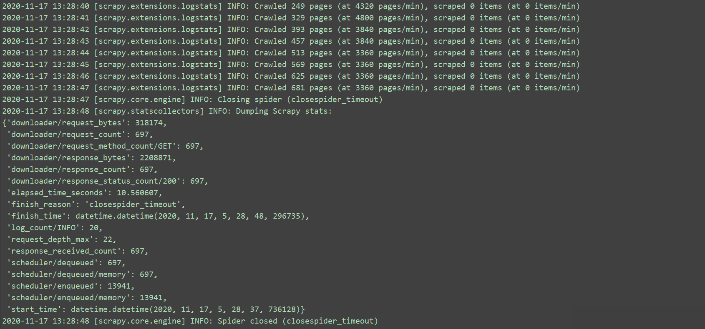
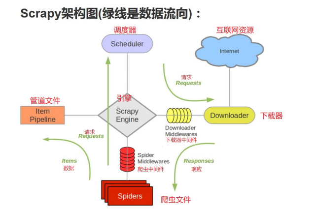
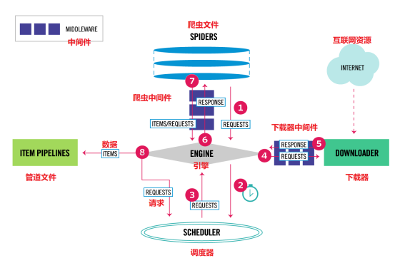

~~~
Scrapy是一个使用Python语言（基于Twisted框架）编写的开源网络爬虫框架，目前由Scrapinghub Ltd维护。Scrapy简单易用、灵活易拓展、开发社区活跃，并且是跨平台的。在Linux、 MacOS以及Windows平台都可以使用。 
~~~

## 1、scrapy简介

### 1、1 网络爬虫

​		网络爬虫是指在互联网上自动爬取网站内容信息的程序，也被称作网络蜘蛛或网络机器人。大型的爬虫程序被广泛应用于搜索引擎、数据挖掘等领域，个人用户或企业也可以利用爬虫收集对自身有价值的数据。

一个网络爬虫程序的基本执行流程可以总结三个过程：**请求数据**， **解析数据**， **保存数据** 

#### 1、1、1 请求数据

请求的数据除了普通的HTML之外，还有 json 数据、字符串数据、图片、视频、音频等。

#### 1、1、2 解析数据

当一个数据下载完成后，对数据中的内容进行分析，并提取出需要的数据，提取到的数据可以以多种形式保存起来，数据的格式有非常多种，常见的有csv、json、pickle等

#### 1、1、3 保存数据

​		最后将数据以某种格式（CSV、JSON）写入文件中，或存储到数据库（MySQL、MongoDB）中。同时保存为一种或者多种。

​		通常，我们想要获取的数据并不只在一个页面中，而是分布在多个页面中，这些页面彼此联系，一个页面中可能包含一个或多个到其他页面的链接，提取完当前页面中的数据后，还要把页面中的某些链接也提取出来，然后对链接页面进行爬取（循环1-3步骤）。

​		设计爬虫程序时，还要考虑防止重复爬取相同页面（URL去重）、网页搜索策略（深度优先或广度优先等）、爬虫访问边界限定等一系列问题。

​		从头开发一个爬虫程序是一项烦琐的工作，为了避免因制造轮子而消耗大量时间，在实际应用中我们可以选择使用一些优秀的爬虫框架，使用框架可以降低开发成本，提高程序质量，让我们能够专注于业务逻辑（爬取有价值的数据）。接下来，就带你学习目前非常流行的开源爬虫框架Scrapy。

### 1、2 scrapy安装

> scrapy官网： https://scrapy.org/
>
> scrapy中文文档：https://www.osgeo.cn/scrapy/intro/overview.html

#### 1、2、1 安装方式

在任意操作系统下，可以使用pip安装Scrapy，例如：

```python
$ pip install scrapy
```

安装完成后我们需要测试安装是否成功，通过如下步骤确认:

* 在 终端 中测试能否执行 scrapy 这条命令：

```python
Scrapy 2.4.0 - no active project

Usage:
  scrapy <command> [options] [args]

Available commands:
  bench				Run quick benchmark test
  fetch				Fetch a URL using the Scrapy downloader
  genspider			 Generate new spider using pre-defined templates
  runspider			 Run a self-contained spider (without creating a project)
  settings			 Get settings values
  shell				Interactive scraping console
  startproject		  Create new project
  version			 Print Scrapy version
  view				Open URL in browser, as seen by Scrapy

  [ more ]      More commands available when run from project directory

Use "scrapy <command> -h" to see more info about a command
```

* 输入 `scrapy bench` 测试连通性，如果出现以下情况表示安装成功：

  

  

通过了以上两项检测，说明Scrapy安装成功了。如上所示，我们安装的是当前最新版本2.4.0。

**注意：**

- 在安装Scrapy的过程中可能会遇到缺少VC++等错误，可以安装缺失模块的离线包


* 链接：https://pan.baidu.com/s/1IfcU8wi_5gkhW4YQwFemtA
  提取码：ga16

  下载 **Microsoft Visual C++ Build Tools.exe** 文件双击安装即可

- 成功安装后，在CMD下运行scrapy出现上图不算真正成功，检测真正是否成功使用`scrapy  bench`测试，如果没有提示错误，就代表成功安装。

具体Scrapy安装流程参考：**<http://doc.scrapy.org/en/latest/intro/install.html##intro-install-platform-notes> **里面有各个平台的安装方法

#### 1、2、2 全局命令

  ```shell
Scrapy 2.4.0 - no active project

Usage:
  scrapy <command> [options] [args]

Available commands:
  bench				Run quick benchmark test
  				   # 测试电脑性能
  fetch				Fetch a URL using the Scrapy downloader
  				   # 将源代码下载下来并显示出来
  genspider			 Generate new spider using pre-defined templates
  				   # 创建一个新的 spider 文件
  runspider			 Run a self-contained spider (without creating a project)
  				   # 这个和通过crawl启动爬虫不同，scrapy runspider 爬虫文件名称
  settings			 Get settings values
  				   # 获取当前的配置信息
  shell				Interactive scraping console
  				   # 进入 scrapy 的交互模式
  startproject		  Create new project
  					# 创建爬虫项目
  version			 Print Scrapy version
  					# 显示scrapy框架的版本
  view				Open URL in browser, as seen by Scrapy
  					# 将网页document内容下载下来，并且在浏览器显示出来

  [ more ]      More commands available when run from project directory

Use "scrapy <command> -h" to see more info about a command
  ```

**项目命令**

+ scrapy startproject projectname

  创建一个项目

- scrapy  genspider  spidername  domain

  创建爬虫。创建好爬虫项目以后，还需要创建爬虫。

- scrapy  crawl  spidername

  运行爬虫。注意该命令运行时所在的目录。

### 1、3 第一个scrapy爬虫

#### 1、3、1 项目需求 

在专门供爬虫初学者训练爬虫技术的网站（http://quotes.toscrape.com）上爬取名言警句。

#### 1、3、2 创建项目

在开始爬取之前，必须创建一个新的 Scrapy 项目。 进入您打算存储代码的目录中，运行下列命令:

```
(base) λ scrapy startproject quotes
New Scrapy project 'quotes', using template directory 'd:\anaconda3\lib\site-packages\scrapy\templates\project', created in:
    D:\课程-爬虫课程\02 框架爬虫\备课代码-框架爬虫\quotes

You can start your first spider with:
    cd quotes
    scrapy genspider example example.com

```

首先切换到新建的爬虫项目目录下，也就是 `/quotes` 目录下。然后执行创建爬虫文件的命令：

```
D:\课程-爬虫课程\02 框架爬虫\备课代码-框架爬虫 (master) 
(base) λ cd quotes\

D:\课程-爬虫课程\02 框架爬虫\备课代码-框架爬虫\quotes (master) 
(base) λ scrapy genspider quotes quotes.com
Cannot create a spider with the same name as your project

D:\课程-爬虫课程\02 框架爬虫\备课代码-框架爬虫\quotes (master) 
(base) λ scrapy genspider quote quotes.com
Created spider 'quote' using template 'basic' in module:
  quotes.spiders.quote
```

该命令将会创建包含下列内容的 `quotes` 目录:

```
 quotes
    │  items.py
    │  middlewares.py
    │  pipelines.py
    │  settings.py
    │  __init__.py
    │
    ├─spiders
       │  quote.py
       │  __init__.py
```

#### 1、3、3 robots.txt

​		robots协议也叫robots.txt（统一小写）是一种存放于[网站](https://baike.baidu.com/item/%E7%BD%91%E7%AB%99)根目录下的[ASCII](https://baike.baidu.com/item/ASCII)编码的文本文件，它通常告诉网络搜索引擎的网络蜘蛛，此网站中的哪些内容是不应被搜索引擎的爬虫获取的，哪些是可以被爬虫获取的。

robots 协议并不是一个规范，而只是约定俗成的。

```python
# filename:settings.py

# Obey robots.txt rules
ROBOTSTXT_OBEY = False
```

#### 1、3、4 分析页面 

编写爬虫程序之前，首先需要对待爬取的页面进行分析，主流的浏览器中都带有分析页面的工具或插件，这里我们选用Chrome浏览器的开发者工具（Tools→Developer tools）分析页面。

**1．数据信息**

在Chrome浏览器中打开页面http://quotes.toscrape.com，然后选择“Elements”，查看其HTML代码。

可以看到每一个标签都包裹在 <div class="quote"> 标签中


#### 1、3、5 编写spider

分析完页面后，接下来编写爬虫。在Scrapy中编写一个爬虫，在 scrapy.Spider 中编写代码

Spider 是用户编写用于从单个网站(或者一些网站)爬取数据的类。

其包含了一个用于下载的初始URL，如何跟进网页中的链接以及如何分析页面中的内容， 提取生成 item 的方法。

为了创建一个Spider，您必须继承 scrapy.Spider 类， 且定义以下三个属性:

- **name:** 用于区别Spider。 该名字必须是唯一的，您不可以为不同的Spider设定相同的名字。
- **start_urls:** 包含了Spider在启动时进行爬取的url列表。 因此，第一个被获取到的页面将是其中之一。 后续的URL则从初始的URL获取到的数据中提取。
- **parse()：** 是 spider 的一个方法。 被调用时，每个初始URL完成下载后生成的 Response 对象将会作为唯一的参数传递给该函数。 该方法负责解析返回的数据(response data)，提取数据(生成item)以及生成需要进一步处理的URL的 Request 对象。

```python
import scrapy


class QuoteSpider(scrapy.Spider):
    name = 'quote'
    allowed_domains = ['quotes.com']
    start_urls = ['http://quotes.toscrape.com/']

    def parse(self, response):
        pass


```

下面对 quote 的实现做简单说明。

**重点：**

* `scrapy.Spider`：爬虫基类，每个其他的spider必须继承自该类(包括Scrapy自带的其他spider以及您自己编写的spider)。

* `name`是爬虫的名字，是在`genspider`的时候指定的。

- `allowed_domains` 是爬虫能抓取的域名，爬虫只能在这个域名下抓取网页，可以不写。

- `start_urls` 是Scrapy抓取的网站，是可迭代类型，当然如果有多个网页，列表中写入多个网址即可，常用列表推导式的形式。

- `parse` 称为回调函数，该方法中的response就是`start_urls`网址发出请求后得到的响应。当然也可以指定其他函数来接收响应。一个页面解析函数通常需要完成以下两个任务：

  - 提取页面中的数据（re、XPath、CSS选择器）
  - 提取页面中的链接，并产生对链接页面的下载请求。

  页面解析函数通常被实现成一个生成器函数，每一项从页面中提取的数据以及每一个对链接页面的下载请求都由yield语句提交给Scrapy引擎。

#### 1、3、6 解析数据

```python
import scrapy

...
    def parse(self, response):
        quotes = response.css('.quote')
        for quote in quotes:
            text = quote.css('.text::text').extract_first()
            auth = quote.css('.author::text').extract_first()
            tages = quote.css('.tags a::text').extract()
            yield dict(text=text, auth=auth, tages=tages)


```

**重点：**

* `response.css()`直接使用css语法即可提取响应中的数据。

- `start_urls`中可以写多个网址，以列表格式分割开即可。

* `extract()`是提取css对象中的数据，提取出来以后是列表，否则是个对象。并且对于`extract_first()` 是提取第一个

#### 1、3、7 运行爬虫 

在 `/quotes` 目录下运行`scrapy  crawl  quotes` 即可运行爬虫项目。

**运行爬虫之后发生了什么？**

Scrapy 为 Spider的 `start_urls` 属性中的每个URL创建了 scrapy.Request 对象，并将 parse 方法作为回调函数(callback)赋值给了Request。

Request对象经过调度，执行生成 scrapy.http.Response 对象并送回给 spider parse() 方法进行处理。

完成代码后，运行爬虫爬取数据，在shell中执行scrapy crawl &lt;SPIDER\_NAME&gt;命令运行爬虫'quote'，并将爬取的数据存储到csv文件中：

```
(base) λ scrapy crawl quote -o quotes.csv
2020-01-08 20:48:44 [scrapy.utils.log] INFO: Scrapy 1.8.0 started (bot: quotes)
....

```

等待爬虫运行结束后，就会在当前目录下生成一个 quotes.csv 的文件，里面的数据已 csv 格式存放。

`-o` 支持保存为多种格式。保存方式也非常简单，只要给上文件的后缀名就可以了。（csv、json、pickle等）

## 2、Scrapy 框架结构

**思考** 

+ scrapy 为什么是框架而不是库？
+ scrapy 是如何工作的？

### 2、1 项目结构

在开始爬取之前，必须创建一个新的 Scrapy 项目。 进入您打算存储代码的目录中，运行下列命令:

> 注意：创建项目时，会在当前目录下新建爬虫项目的目录。

这些文件分别是:

- `scrapy.cfg`: 项目的配置文件
- `quotes/`: 该项目的python模块。之后您将在此加入代码
- `quotes/items.py`: 项目中的item文件
- `quotes/middlewares.py`: 爬虫中间件、下载中间件（处理请求体与响应体）
- `quotes/pipelines.py`: 项目中的pipelines文件
- `quotes/settings.py`: 项目的设置文件
- `quotes/spiders/`: 放置spider代码的目录

**Scrapy原理图** 



### 2、1 各个组件的介绍

1. **Engine**。引擎,处理整个系统的数据流处理、触发事务,是整个框架的核心。

2. **Item**。项目,它定义了爬取结果的数据结构,爬取的数据会被赋值成该Item对象。

3. **Scheduler**。调度器,接受引擎发过来的请求并将其加入队列中,在引擎再次请求的时候将请求提供给引擎。

4. **Downloader**。下载器,下载网页内容,并将网页内容返回给蜘蛛。

5. **Spiders**。 蜘蛛,其内定义了爬取的逻辑和网页的解析规则,它主要负责解析响应并生成提结果和新的请求。

6. **Item Pipeline**。项目管道,负责处理由蜘蛛从网页中抽取的项目,它的主要任务是清洗、验证和存储数据。

7. **Downloader Middlewares**。下载器中间件,位于引擎和下载器之间的钩子框架,主要处理引擎与下载器之间的请求及响应。

8. **Spider Middlewares**。 蜘蛛中间件,位于引擎和蜘蛛之间的钩子框架,主要处理蜘蛛输入的响应和输出的结果及新的请求。



### 2、2 数据的流动

- Scrapy Engine(引擎): 负责Spider、ItemPipeline、Downloader、Scheduler中间的通讯，信号、数据传递等。
- Scheduler(调度器): 负责接受引擎发送过来的Request请求，并按照一定的方式进行整理排列，入队，当引擎需要时，交还给引擎。
- Downloader(下载器)：负责下载Scrapy Engine(引擎)发送的所有Requests请求，并将其获取到的Responses交还给Scrapy Engine(引擎)，由引擎交给Spider来处理，
- Spider（爬虫）：负责处理所有Responses,从中分析提取数据，获取Item字段需要的数据，并将需要跟进的URL提交给引擎，再次进入Scheduler(调度器)，
- Item Pipeline(管道)：负责处理Spider中获取到的Item，并进行进行后期处理（详细分析、过滤、存储等）的地方.
- Downloader Middlewares(下载中间件)：你可以当作是一个可以自定义扩展下载功能的组件。
- Spider Middlewares(Spider中间件)：你可以理解为是一个可以自定扩展和操作引擎和Spider中间通信的功能组件（比如进入Spider的Responses;和从Spider出去的Requests）

## 3、scrapy.Spider

Spider 类定义了如何爬取某个(或某些)网站。包括了爬取的动作(例如:是否跟进链接)以及如何从网页的内容中提取结构化数据(爬取item)。 换句话说，Spider就是您定义爬取的动作及分析某个网页(或者是有些网页)的地方。

对spider来说，爬取的循环类似下文:

1. 以初始的URL初始化Request，并设置回调函数。 当该request下载完毕并返回时，将生成response，并作为参数传给该回调函数。

   spider中初始的request是通过调用 start_requests()来获取的。 start_requests() 读取 start_urls 中的URL， 并以 parse 为回调函数生成 Request。

2. 在回调函数内分析返回的(网页)内容，返回 Item 对象或者 Request 或者一个包括二者的可迭代容器。 返回的Request对象之后会经过Scrapy处理，下载相应的内容，并调用设置的callback函数(函数可相同)。

3. 在回调函数内，您可以使用 [选择器(Selectors)](https://scrapy-chs.readthedocs.io/zh_CN/latest/topics/selectors.html##topics-selectors) (您也可以使用BeautifulSoup, lxml 或者您想用的任何解析器) 来分析网页内容，并根据分析的数据生成item。

4. 最后，由spider返回的item将被存到数据库(由某些 Item Pipeline处理)或使用 Feed exports存入到文件中。

虽然该循环对任何类型的spider都(多少)适用，但Scrapy仍然为了不同的需求提供了多种默认spider。 之后将讨论这些spider。

### 3、1 Spider

scrapy.spider.Spider 是最简单的spider。每个其他的spider必须继承自该类(包括Scrapy自带的其他spider以及您自己编写的spider)。 其仅仅请求给定的 start_urls / start_requests ，并根据返回的结果(resulting responses)调用 spider 的 parse 方法。

#### name

定义 spider 名字的字符串(string)。spider 的名字定义了 Scrapy 如何定位(并初始化) spider ，所以其必须是唯一的。 不过您可以生成多个相同的 spider 实例(instance)，这没有任何限制。 name 是 spider 最重要的属性，而且是必须的。

如果该 spider 爬取单个网站(single domain)，一个常见的做法是以该网站(domain)(加或不加后缀 )来命名 spider 。 例如，如果 spider 爬取 `mywebsite.com` ，该spider通常会被命名为 `mywebsite` 。

#### allowed_domains

可选。包含了spider允许爬取的域名(domain)列表(list)。 当 OffsiteMiddleware 启用时， 域名不在列表中的URL不会被跟进。

#### start_urls

URL 列表。当没有制定特定的 URL 时，spider 将从该列表中开始进行爬取。 因此，第一个被获取到的页面的 URL 将是该列表之一。 后续的 URL 将会从获取到的数据中提取。

#### start_requests()

该方法必须返回一个可迭代对象(iterable)。该对象包含了spider用于爬取的第一个 Request。

当 spider 启动爬取并且未制定 URL 时，该方法被调用。 当指定了URL时，make_requests_from_url() 将被调用来创建 Request 对象。 该方法仅仅会被 Scrapy 调用一次，因此您可以将其实现为生成器。

该方法的默认实现是使用 start_urls 的url生成 Request。

如果您想要修改最初爬取某个网站的Request对象，您可以重写(override)该方法。 例如，如果您需要在启动时以 POST 登录某个网站，你可以这么写:

```python
def start_requests(self):
    return [scrapy.FormRequest("http://www.example.com/login",
                               formdata={'user': 'john', 'pass': 'secret'},
                               callback=self.logged_in)]

def logged_in(self, response):
    ## here you would extract links to follow and return Requests for
    ## each of them, with another callback
    pass

```

#### parse

当response没有指定回调函数时，该方法是Scrapy处理下载的response的默认方法。

`parse` 负责处理response并返回处理的数据以及(/或)跟进的URL。 Spider 对其他的Request的回调函数也有相同的要求。

该方法及其他的Request回调函数必须返回一个包含 Request 及(或) Item 的可迭代的对象。

参数: response– 用于分析的response 

### 3、2 启动方式

#### 3、2、1 start_urls

start_urls 是一个列表

#### 3、2、2 start_requests

使用`start_requests()` 重写`start_urls`，要使用`Request()`方法自己发送请求：

```python
    def start_requests(self):
        """重写 start_urls 规则"""
        yield scrapy.Request(url='http://quotes.toscrape.com/page/1/', callback=self.parse)

```

#### 3、2、3 scrapy.Request

scrapy.Request 是一个请求对象，创建时必须制定回调函数。

#### 3、2、4 数据保存

可以使用 -o 将数据保存为常见的格式（根据后缀名保存）

支持的格式有下面几种：

+ json
+ jsonlines
+ jl
+ csv
+ xml
+ marshal
+ pickle

使用方式：

 ```
scrapy crawl quotes2 -o a.json

 ```

#### 案例：Spider 样例

让我们来看一个例子:

```python
## -*- coding: utf-8 -*-
import scrapy


class Quotes2Spider(scrapy.Spider):
    name = 'quotes2'
    allowed_domains = ['toscrape.com']
    start_urls = ['http://quotes.toscrape.com/page/2/']

    def parse(self, response):
        quotes = response.css('.quote')
        for quote in quotes:
            text = quote.css('.text::text').extract_first()
            auth = quote.css('.author::text').extract_first()
            tages = quote.css('.tags a::text').extract()
            yield dict(text=text,auth=auth,tages=tages)


```

## 4、Item

​		`Item`是保存爬取数据的容器,它的使用方法和字典类似。不过,相比字典,`Item`提供了额外的保护机制,可以避免拼写错误或者定义字段错误。

​		创建`Item`需要继承`scrapy.Item`类,并且定义类型为`scrapy.Field`的字段。在创建项目开始的时候`Item`文件是这样的。

```python
import scrapy

class TutorialItem(scrapy.Item):
    # define the fields for your item here like:
    # 参照下面这个参数定义你的字段
    # name = scrapy.Field()
    pass


```

​		在保存数据的时候可以每次初始化一个字典等格式，但是最方便，最好的保存方式就是使用 Scrapy 自带的 Item 数据结构了。

我们学习了从页面中提取数据的方法，接下来学习如何封装爬取到的数据。应该用怎样的数据结构来维护这些零散的信息字段呢？最容易想到是使用Python字典（dict）。

回顾之前的代码

```python
class QuotesSpider(scrapy.Spider):
    name = 'quotes'
    allowed_domains = ['toscrape.com']
    start_urls = ['http://quotes.toscrape.com/']

    def parse(self, response):
        quotes = response.css('.quote')

        for quote in quotes:
            text = quote.css('.text::text').get()
            author = quote.css('.author::text').get()
            tags = quote.css('.tag::text').getall()

            yield {
                'text': text,
                'author': author,
                'tags': tags,
            }

```

在该案例中，我们便使用了Python字典存储一条数据的信息，但字典可能有以下缺点：

（1）无法一目了然地了解数据中包含哪些字段，影响代码可读性。

（2）缺乏对字段名字的检测，容易因程序员的笔误而出错。

（3）不便于携带元数据（传递给其他组件的信息）。

为解决上述问题，在Scrapy中可以使用自定义的Item类封装爬取到的数据。

### 4、1 Item 和 Field 

Scrapy提供了以下两个类，用户可以使用它们自定义数据类（如书籍信息），封装爬取到的数据：

#### 4、1、1 Item 基类

数据结构的基类，在items.py中定义数据结构时，需要继承自该基类。

#### 4、1、2 Field 类

用来描述自定义数据类包含哪些字段（如name、price等）。

自定义一个数据类，只需继承Item，并创建一系列Field对象的类属性即可。

以定义书籍信息 quote 为例，它包含个字段，分别为书的名字text、author和tags，代码如下：

```python
# 特殊的字典结构 可以在scrapy中传递数据
class TutorialItem(scrapy.Item):
    # Field 字段
    # 就是类似于产生一个类似字典格式的数据  拥有字典的一些属性
    # 字段默认为空
    # 我们可以通过实例化 像着键赋值 但是如果没有写这个键 就不能赋值 但是字典可以
    text = scrapy.Field()
    author = scrapy.Field()
    tags = scrapy.Field()

```

Item支持字典接口，因此 TutorialItem 在使用上和Python字典类似。

对字段进行赋值时，TutorialItem 内部会对字段名进行检测，如果赋值一个没有定义的字段，就会抛出异常（防止因用户粗心而导致错误）

## 5、 scrapy.Request

> Request 和 Response 对象，用于爬网网站。 

Request对象用来描述一个HTTP请求，下面是其构造器方法的参数列表：

```
Request(url, callback=None, method='GET', headers=None, body=None,
        cookies=None, meta=None, encoding='utf-8', priority=0,
        dont_filter=False, errback=None, flags=None, cb_kwargs=None)

```

- **url**（*字符串*）–此请求的URL
- **callback**（*callable*）–将以请求的响应（一旦下载）作为第一个参数调用的函数。有关更多信息，请参见下面的将其他数据传递给回调函数。如果“请求”未指定回调，parse() 则将使用“Spider” 方法。请注意，如果在处理过程中引发异常，则会调用errback。
- **method**（*字符串*）–此请求的HTTP方法。默认为`'GET'`。
- **meta**（dict）– Request.meta属性的初始值。如果给出，则在此参数中传递的字典将被浅表复制。
- **headers**（dict）–请求头。dict值可以是字符串（对于单值标头）或列表（对于多值标头）。如果 `None`作为值传递，则将根本不发送HTTP标头。

```python
class QuotesSpider(scrapy.Spider):
    name = 'quotes_3'

    allowed_domains = ['toscrape.com']

    start_urls = ['http://quotes.toscrape.com/']


    def parse(self, response):
        quotes = response.css('.quote')

        for quote in quotes:
            text = quote.css('.text::text').get()
            author = quote.css('.author::text').get()
            tags = quote.css('.tag::text').getall()
            yield Qd01QuotesItem(text=text, author=author, tags=tags)

            next_page = response.css('.next a::attr(href)').get()
            if next_page:                                                       
                next_url = 'http://quotes.toscrape.com' + next_page
                yield scrapy.Request(next_url, callback=self.parse)

```

### 5、1 meta的使用

meta 参数主要用于在两个函数之间传递参数

meta 一次性的，每次创建 request 对象，都会重新创建

meta是一个字典，它的主要作用是用来传递数据的，meta = {‘key1’:value1}，如果想在下一个函数中取出 value1, 只需得到上一个函数的 meta[‘key1’] 即可， 因为meta是随着Request产生时传递的，下一个函数得到的Response对象中就会有meta，即 response.meta。请瞧下面的简单例子更好的帮助理解：

```python
class KfcSpider(scrapy.Spider):
    name = 'KFC'
    allowed_domains = ['kfc.com.cn']
    # start_urls = ['http://kfc.com.cn/']

    def start_requests(self):
        yield scrapy.FormRequest('http://www.kfc.com.cn/kfccda/ashx/GetStoreList.ashx?op=keyword',
                                 formdata={
                                    'cname': '',
                                    'pid': '',
                                    'keyword': '北京',
                                    'pageIndex': '1',
                                    'pageSize': '10',
                                 },
                                 callback=self.parse,
                                 # 用来翻页
                                 meta={'page': 2}
                                 )
        
    def parse1(self, response):
        # 第二页的请求参数
        page = response.meta.get('page')

```

## 6、Item Pipeline

​		当 spider 获取到数据（item）之后，就会将数据发送到 Item Pipeline，Item Pipeline 通过顺序执行的几个组件处理它。

​		在Scrapy中，Item Pipeline是处理数据的组件，一个Item Pipeline就是一个包含特定接口的类，通常只负责一种功能的数据处理，在一个项目中可以同时启用多个Item Pipeline，它们按指定次序级联起来，形成一条数据处理流水线。

Item Pipeline 的典型用途是：

+ 清理HTML数据
+ 验证的数据（检查项目是否包含某些字段）
+ 进行数据的保存

### 6、1 Item Pipeline 使用

​		Scrapy 提供了 `pipeline` 模块来执行保存数据的操作。在创建的 Scrapy 项目中自动创建了一个 `pipeline.py` 文件，同时创建了一个默认的 `Pipeline` 类：

```python
class TutorialPipeline(object):
    def process_item(self, item, spider):
        return item

```

在这个类中，有个方法叫 process_item() 方法，每个 Pipeline 都需要调用该方法。

process_item() 方法必须返回一个字典数据。默认有两个参数。如果把 Item 删除了那就不会再调用其他 Pipeline 方法了。

参数：

+ **item** ( Item 对象 dict) 

+ **spider** (Spider 对象) 

既然有了数据，那么就可以保存了：

```python
class Qd03EnglishPipeline:
    def process_item(self, item, spider):
        print('item_info_2', item)
        with open('english.csv', mode='a', encoding='utf-8') as f:
            f.write(item['title'] + ',' + item['info'] + ',' + item['img_url'])
            f.write('\n')
        return item

```

### 6、2 启用 Item Pipeline组件

只是上面定义方法还不行，还要激活该组件，也就是激活管道文件才能保存数据。激活是在配置文件`setteings.py`文件中激活，在配置文件中找到如下变量值取消注释：

```python
ITEM_PIPELINES = {
   'qd_03_english.pipelines.Qd03EnglishPipeline': 300,
}

```

**重点：**

在上图中的字典结构的配置中，键是管道文件所在的路径，值是该管道文件的激活顺序，**数字越小代表越早激活** 。因为有时候会有多个管道文件。

**完整的 item pipeline **

```python
import something

class SomethingPipeline(object):
    def __init__(self):    
        ## 可选实现，做参数初始化等
        ## doing something
        pass
    
    def open_spider(self, spider):
        ## spider (Spider 对象) – 被开启的spider
        ## 可选实现，当spider被开启时，这个方法被调用。
        pass
    
    def process_item(self, item, spider):
        ## item (Item 对象) – 被爬取的item
        ## spider (Spider 对象) – 爬取该item的spider
        ## 这个方法必须实现，每个item pipeline 组件都需要调用该方法，
        ## 这个方法必须返回一个 Item 对象，被丢弃的item将不会被之后的pipeline组件所处理。
        return item

    def close_spider(self, spider):
        ## spider (Spider 对象) – 被关闭的spider
        ## 可选实现，当spider被关闭时，这个方法被调用
        pass

```

* 写入JSON文件

以下 pipeline 将所有(从所有'spider'中)爬取到的item，存储到一个独立地items.json 文件，每行包含一个序列化为'JSON'格式的'item'。

```python
class JSONPipeline:
    def __init__(self):
        self.f = open('data.json', mode='w', encoding='utf-8')
        # 收集每一条 item 数据
        self.d_list = []

    def process_item(self, item, spider):
        d = dict(item)
        return item

    def close_spider(self, spider):
        self.f.write(json.dumps(self.d_list, ensure_ascii=False))
        return item
        self.f.close()

```

* 写入CSV文件

  ~~~python
  class CSVPipeline:
      def __init__(self):
          self.f = open('data.csv', mode='a', encoding='utf-8', newline='')
          self.csv_write = csv.DictWriter(self.f, ['title', 'info', 'img_url'])
          self.csv_write.writeheader()
  
      def process_item(self, item, spider):
          d = dict(item)
          self.csv_write.writerow(d)
          return item
  
      def close_spider(self, spider):
          self.f.close()
  
  ~~~

**注意：一定要修改配置文件**

在写好以后要在配置文件 `settings.py` 中激活，并指定激活顺序。

~~~python
ITEM_PIPELINES = {
   'qd_03_english.pipelines.Qd03EnglishPipeline': 300,
   'qd_03_english.pipelines.CSVPipeline': 299,
   'qd_03_english.pipelines.JSONPipeline': 298,
}

~~~

## 7、 Middlewares

### 7、1 Downloader Middlewares

Downloader Middlewares(下载器中间件)，位于 scrapy 引擎和下载器之间的一层组件。作用：

- 引擎将 **请求** 传递给下载器之前， **下载中间件** 可以对 **请求** 进行一系列处理。比如设置请求的User-Agent，设置代理等
- 在下载器完成将Response传递给引擎之前，下载中间件可以对响应进行一系列处理。

我们主要使用下载中间件处理请求，一般会对请求设置随机的User-Agent，设置随机的代理。目的在于防止爬取网站的反爬虫策略。

 **如果完全没有中间件，爬虫的流程如下图所示。** 

   

**使用了中间件以后，爬虫的流程如下图所示。** 


Scrapy 自动生成的这个文件名称为 middlewares.py，名字后面的 s 表示复数，说明这个文件里面可以放很多个中间件。可以看到有一个 **SpiderMiddleware** （爬虫中间件）中间件 和 **DownloaderMiddleware** （下载中间件）中间件 

在 middlewares.py 中添加下面一段代码（可以在 **下载中间件这个类** 里面写，也可以把 **爬虫中间件** 和 **下载中间件** 这两个类删了，自己写个 下载中间件的类。推荐自己单写一个类作为下载中间件）： 

默认下载器中间件代码如下：

```python
class TutorialDownloaderMiddleware(object):
    # Not all methods need to be defined. If a method is not defined,
    # scrapy acts as if the downloader middleware does not modify the
    # passed objects.

    @classmethod
    def from_crawler(cls, crawler):
        # This method is used by Scrapy to create your spiders.
        s = cls()
        crawler.signals.connect(s.spider_opened, signal=signals.spider_opened)
        return s

    def process_request(self, request, spider):
        # Called for each request that goes through the downloader middleware.
        # 调用通过下载器中间件的每个请求。

        # Must either:
        # - return None: continue processing this request
        # - or return a Response object
        # - or return a Request object
        # - or raise IgnoreRequest: process_exception() methods of
        #   installed downloader middleware will be called

        # 必须：
        # - return None：继续处理这个请求
        # - 或者返回一个 Response 对象
        # - 或者返回一个 Request 对象
        # - 或者抛出 IgnoreRequest ：下载中间件的 process_exception() 将被激活
        return None

    def process_response(self, request, response, spider):
        # Called with the response returned from the downloader.
        # 调用 downloader 返回的 response

        # Must either;
        # - return a Response object
        # - return a Request object
        # - or raise IgnoreRequest

        # 必须：
        # - 返回一个 Response 对象
        # - 返回一个 Request 对象
        # - 或者抛出一个 IgnoreRequest
        return response

    def process_exception(self, request, exception, spider):
        # Called when a download handler or a process_request()
        # (from other downloader middleware) raises an exception.

        # 激发一个下载处理器或者一个 process_request() (来自其他下载器中间件) 抛出一个异常
        
        # Must either:
        # - return None: continue processing this exception
        # - return a Response object: stops process_exception() chain
        # - return a Request object: stops process_exception() chain
        
        # 必须：
        # - return None：继续处理这个请求
        # - 或者返回一个 Response 对象: 停止 process_exception() 调用链
        # - 或者返回一个 Requests 对象: 停止 process_exception() 调用链
        pass

    def spider_opened(self, spider):
        spider.logger.info('Spider opened: %s' % spider.name)


```

#### process_request

> process_request(self, request, spider)

该方法是下载器中间件类中的一个方法，该方法是每个请求从引擎发送给下载器下载之前都会经过该方法。所以该方法经常用来处理请求头的替换，IP的更改，Cookie等的替换。

**参数:** 

- request (Request 对象) – 处理的request

- spider (Spider 对象) – 该request对应的spider

#### process_response

> process_response(self, request, response, spider)

该方法是下载器中间件类中的一个方法，该方法是每个响应从下载器发送给spider之前都会经过该方法。

**参数**：

* request (Request 对象) – response所对应的request 

* response (Response 对象) – 被处理的response 

* spider (Spider 对象) – response所对应的spider 

### 7、2 随机替换请求头

有些网站需要用户在访问的时候确认用户采用的是用浏览器来进行访问的，也就是常见的User-Agent信息。在Scrapy中也可以设置相应的请求头信息。

```python
class UserAgentDownloaderMiddleware(object):
    def __init__(self):
        self.fake = Faker('en_US')

    def process_request(self, request, spider):
        useragent = self.fake.user_agent()
        request.headers.update({"User-Agent": useragent})
        return None


```

**注意：**

除了编写下载器中间件，还需要激活配置好的中间件才能生效。


**重点：**

`DOWNLOADER_MIDDLEWARES` 设置会与 Scrapy 默认定义的 `DOWNLOADER_MIDDLEWARES_BASE`设置合并(但不是覆盖)， 而后根据顺序(order)进行排序，最后得到启用中间件的有序列表: 第一个中间件是最靠近引擎的，最后一个中间件是最靠近下载器的。

关于如何分配中间件的顺序请查看 `DOWNLOADER_MIDDLEWARES_BASE` 设置，而后根据想要放置中间件的位置选择一个值。 **由于每个中间件执行不同的动作，中间件可能会依赖于之前(或者之后)执行的中间件，因此顺序是很重要的。**

faker 是一个虚假数据生成库,可以随机生成各种虚假数据用于测试

```
import faker
fake = faker.Faker()
fake.name()
Out[4]: 'John Richardson'
fake.name_male()
Out[5]: 'Anthony Jackson'
fake.user_agent()
Out[6]: 'Mozilla/5.0 (compatible; MSIE 8.0; Windows NT 5.2; Trident/3.1)'

```

### 7、3 随机替换IP

​		当使用Scrapy爬虫大规模请求某个网站时，经常会遇到封禁IP的情况。在这种情况下，设置IP代理就非常重要了。在Scrapy中设置代理IP也很简单，其原理就是在发送请求之前，指定一个可用的IP代理服务器即可。同样，IP的设置也是在下载器中间件里面设置，自定义自己的IP代理中间件。

```python
class HttpProxyDownloaderMiddleware(object):
    def __init__(self):
        self.fake = Faker()

    def process_request(self, request, spider):
        proxy = "117.57.90.19:31840"
        request.meta['proxy'] = 'http://' + proxy
        return None


```

**注意：**  需要激活代理中间件。

### 7、4 设置 Cookie 值

有时候我们想要爬取的数据可以需要登录才能看到，这时候我们就需要登录网页。登陆后的网页一般都会在本地保存该网页的登录信息Cookies在本地。只要获取该Cookie，那么在以后跳转到其他网页的时候，只需要携带该Cookie即可。

```python
class CookieDownloaderMiddleware(object):
    def process_request(self, request, spider):
        cookie = "cookie"
        request.headers.update({'Cookie': cookie})
        return None

```

**注意：** 需要激活Cookie中间件。

### 7、5 超时重试

可以直接查看scrapy的源码，在setting文件夹下的 default_settings.py 文件里面可以找到超时重试的配置选项。

 ```
RETRY_ENABLED = True	# 是否开启超时重试
RETRY_TIMES = 2  # initial response + 2 retries = 3 requests 重试次数
RETRY_HTTP_CODES = [500, 502, 503, 504, 522, 524, 408, 429]  # 重试的状态码

DOWNLOAD_TIMEOUT = 1  # 设置超时的时间

 ```

## 8、scrapy 发送POST请求

* scrapy 框架中封装的 FormRequest 方法可以帮助我们发送post请求

~~~python
def start_requests(self):
    yield scrapy.FormRequest('http://www.kfc.com.cn/kfccda/ashx/GetStoreList.ashx?op=keyword',
                             formdata={
                                 'cname': '',
                                 'pid': '',
                                 'keyword': '北京',
                                 'pageIndex': '1',
                                 'pageSize': '10',
                             },
                             callback=self.parse
                            )  

~~~

## 9、scrapy 下载二进制数据

​		二进制文件的下载也是实际应用中很常见的一种需求，例如使用爬虫爬取网站中的图片、视频、WORD文档、PDF文件、压缩包等。本章来学习在Scrapy中如何下载二进制数据。

​		scrapy专门封装了一个下载二进制数据的 `ImagesPipeline`。

​		我们可以将ImagesPipeline 看作特殊的下载器，用户使用时只需要通过item的一个特殊字段将要下载文件或图片的url传递给它们，它们会自动将文件或图片下载到本地，下面详细介绍如何使用它们。

**ImagesPipeline使用说明**

目标网址：https://www.duitang.com/

有时候可能会采集图片资源，Scrapy帮我们实现了图片管道文件，很方便保存图片：

~~~python
class DownloadPicturePipeline(ImagesPipeline):
	"""二进制数据的中间件"""
	# get_media_requests 是请求二进制数据的方法
	def get_media_requests(self, item, info):
	# 把图片下载地址的url构建成一个requests
	img_url = item['img_url']
	# 构建一个图片的请求
	yield scrapy.Request(url=img_url)

~~~

重点：

* `get_media_requests()` 是用来发送请求的，需要传入图片的网址。
* 除了编写图片管道文件，还要在配置环境中激活，以及指定图片的存储位置。

~~~python
ITEM_PIPELINES = {
'qd_06_duitang.pipelines.DownloadPicturePipeline': 300,
}

# 二进制数据存储的路径
IMAGES_STORE = './images'

~~~

